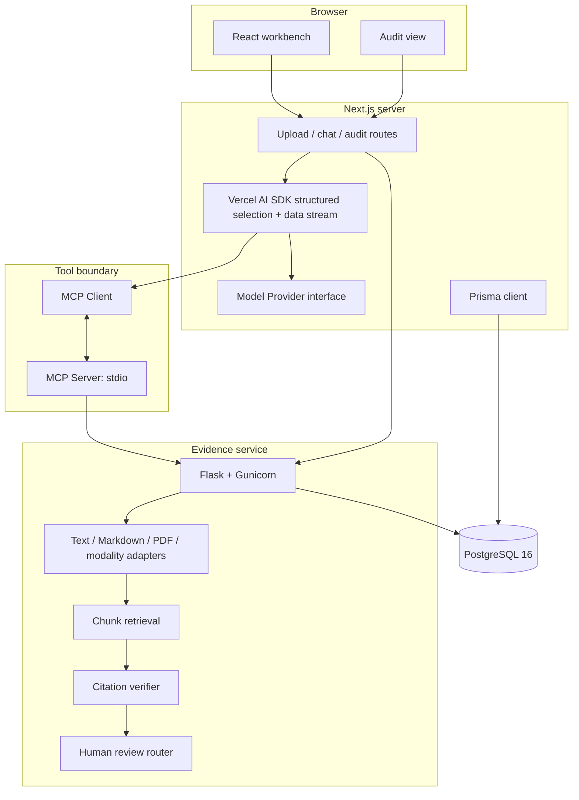

# Architecture

## Design goal

EvidenceBridge keeps generation downstream of evidence acquisition and verification. A fluent answer is never considered proof: the durable objects are source bytes, parsed chunks, locators, tool calls, verification decisions, and review records.

## Components and ownership

| Component | Responsibility | Trust level |
|---|---|---|
| `apps/web` | Session UI, upload proxy, streaming agent, evidence/trace rendering, Prisma conversation write | User-facing; escapes rendered text |
| `apps/mcp-server` | MCP capability boundary, Zod schemas, timeouts, service authentication | Trusted control plane |
| `apps/flask-service` | File validation, parsing, chunking, retrieval, citation comparison, review routing, audit | Trusted service processing untrusted content |
| `packages/db` | PostgreSQL contract, migration, seed, Prisma runtime client | Durable system of record |
| `evaluation` | Synthetic corpus, gold questions, deterministic baselines and raw records | Reproducibility layer |

## Runtime topology



## Evidence answer sequence

```mermaid
sequenceDiagram
  actor User
  participant Web as Next.js + AI SDK
  participant MCP as MCP server
  participant Flask as Evidence service
  participant DB as PostgreSQL
  participant Human as Reviewer

  User->>Web: Ask question in workspace
  Web->>MCP: search_documents(workspace_id, query)
  MCP->>Flask: POST /api/search
  Flask->>DB: Query chunks; store Evidence, ToolCall, AuditEvent
  Flask-->>MCP: Ranked quotes + document locators
  MCP-->>Web: Structured MCP result
  Web->>MCP: verify_citation(chunk_id, quote)
  MCP->>Flask: POST /api/verify
  Flask->>DB: Store verification trace
  alt absent, conflicting, unverified, or high-risk
    Web->>MCP: request_human_review(...)
    MCP->>Flask: POST /api/reviews
    Flask->>DB: Store HumanReview
    Human-->>User: Later decision outside automated boundary
  else supported and low-risk
    Web-->>User: Stream answer + exact source locator
  end
  Web->>DB: Persist conversation and messages with Prisma
```

## Retrieval and citation semantics

Chunks preserve page numbers for PDFs, line ranges for text/Markdown, and time ranges for audio transcripts. Retrieval v2 combines inspectable lexical IDF/coverage scoring with explicit document-version filtering, latest-version tie-breaking, stopword removal, and a small disclosed normalization map. It is metadata-aware but is not an embedding retriever. `verify_citation` normalizes whitespace and first performs an exact containment check; a similarity threshold of 0.82 is a fallback. Verification means “the quoted string matches the chunk,” not “the answer is semantically correct.” The evaluation therefore applies a stricter citation metric that also requires the correct gold source and expected answer phrase.

## Model provider boundary

`resolveModelProvider` returns a uniform provider resolution. Mock mode runs the MCP evidence workflow deterministically and emits the Vercel AI data-stream protocol. Credentialed modes return a Vercel AI SDK `LanguageModelV1`. The server first runs MCP retrieval, verification, and risk routing; the model can then select only an exact quotation from the bounded candidate set through structured generation. The server rejects an out-of-set chunk or failed post-selection MCP verification before opening the response stream.

The Azure adapter is implemented but not verified against a live Azure deployment.

## Persistence

The Prisma migration creates `Workspace`, `Document`, `DocumentChunk`, `Evidence`, `Conversation`, `Message`, `ToolCall`, `EvaluationRun`, `HumanReview`, and `AuditEvent` storage. Flask uses parameterised Psycopg queries against that schema for evidence operations; Next.js uses the generated Prisma client for conversation turns when `DATABASE_URL` is present. This split makes the cross-language contract visible but adds migration coordination cost.

## Failure behavior

- Parser, validation, and missing-source errors use stable JSON codes.
- MCP-to-Flask requests have a 15-second default timeout and always close their client transport.
- No-result and high-risk mock paths create review records before answering.
- API responses disable caching and add basic anti-sniffing/frame headers.
- Service failures return a bounded message; secrets and source bodies are not written to application logs.
