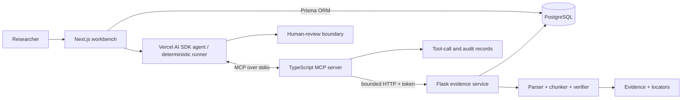

# EvidenceBridge Multimodal MCP

[](https://github.com/zcy0109/evidencebridge-mcp/actions/workflows/ci.yml)

An evidence-first research workbench for policy, legal, teaching, and public-information materials. It is designed as a verifiable engineering artifact for the [HKU AI Engineer / Research Assistant II role (537095)](https://jobs.hku.hk/cw/en/job/537095/ai-engineer-at-the-rank-of-research-assistant-ii-in-the-school-of-computing-and-data-science) and the [PolyU Research Assistant role (260401018)](https://jobs.polyu.edu.hk/job_detail.php?job=260401018), not as a generic chatbot.

The default mode needs no model key. A deterministic agent searches uploaded sources through a real MCP stdio server, verifies the selected quotation, routes uncertain or high-risk requests to human review, streams the answer to the UI, and records an audit trail. OpenAI-compatible and Azure OpenAI adapters are included for credentialed environments.

> **Truthful status:** Azure adapter implemented but not verified against a live Azure deployment. No Azure, production deployment, real-user, real-LLM, or completed model-training result is claimed.

## What works

- Next.js 15 / React / TypeScript workbench with Vercel AI SDK streaming, source upload, tool trace, evidence cards, locators, and audit page.
- Flask / Gunicorn service for UTF-8 text, Markdown, and PDF extraction; bounded chunking; lexical retrieval; exact/fuzzy citation verification; version diff; review routing; health checks; structured errors; and privacy-conscious logs.
- Official `@modelcontextprotocol/sdk` stdio server with executable `search_documents`, `get_evidence`, `verify_citation`, `compare_document_versions`, and `request_human_review` tools and Zod input schemas.
- PostgreSQL schema managed by Prisma ORM, checked-in migration and seed, plus runtime Prisma conversation persistence and Flask access to the same schema.
- Image and audio adapter boundaries that accept an explicit transcript fixture. OCR/transcription is never fabricated when an engine is unavailable.
- A 45-question gold dataset comparing direct answer, basic RAG, and RAG with citation verification. Raw per-question outputs and run metadata are saved.
- Docker Compose PostgreSQL, Gunicorn config, Apache reverse-proxy example, CI, unit/integration tests, and an optional—not completed—LoRA router experiment.

## Architecture



See [ARCHITECTURE.md](./ARCHITECTURE.md) for trust boundaries and sequence details.

## Quick start

Prerequisites: Node.js 22+, pnpm 11+, Python 3.12+, and Docker with Compose.

```bash
cp .env.example .env
./scripts/bootstrap.sh
./scripts/dev.sh
```

Open <http://localhost:3000>, choose **Load synthetic demo set**, and ask “When do applications close?” The deterministic mock mode is the default and uses no external API.

Manual equivalent:

```bash
docker compose up -d postgres
pnpm install --frozen-lockfile
python3 -m venv .venv
.venv/bin/pip install -r apps/flask-service/requirements-dev.txt
pnpm db:generate && pnpm db:migrate && pnpm db:seed
pnpm --filter @evidencebridge/mcp-server build
pnpm dev
```

For a database-free UI demonstration, omit `DATABASE_URL`; the Flask service uses an explicit in-memory repository. That mode is ephemeral and is not evidence of PostgreSQL integration. Docker-backed CI runs the PostgreSQL integration test.

## Model providers

Set `MODEL_PROVIDER` to one of:

- `mock`: deterministic offline workflow. It is reproducible but is **not a real LLM result**.
- `openai-compatible`: uses `OPENAI_API_KEY`, `OPENAI_BASE_URL`, and `MODEL_NAME` through the Vercel AI SDK.
- `azure`: uses `AZURE_OPENAI_ENDPOINT`, `AZURE_OPENAI_API_KEY`, `AZURE_OPENAI_DEPLOYMENT`, and `AZURE_OPENAI_API_VERSION`.

Credentialed modes use Vercel AI SDK structured generation only after server-enforced MCP retrieval and risk preflight. The selected quotation is then verified again through MCP before the AI data stream is opened; an out-of-set chunk, citation mismatch, or high-risk request creates a review and returns a refusal. Documents are explicitly treated as untrusted data. Never commit `.env`.

## Verification and evaluation

```bash
pnpm lint
pnpm test
pnpm build
pnpm evaluate
.venv/bin/python peft/smoke_test.py
```

The saved v2 deterministic run `20260908T090054Z` used the same fixed 45-question regression set as the original v1 diagnosis. After metadata-aware version filtering, latest-version tie-breaking, content-coverage ranking, and a small disclosed normalization map, the verified workflow reached 1.000 on strict citation accuracy, evidence-retrieval recall, tool-call success, and human-review recall, with a 0.000 unsupported/mismatch rate. These are **in-sample deterministic regression results after inspecting the same dataset**, not held-out, real-LLM, or production-performance results. The original v1 run is retained for comparison. See [EVALUATION.md](./EVALUATION.md) and the raw records under `evaluation/runs/`.

## Project map

```text
apps/web             Next.js UI, provider adapters, agent route, audit view
apps/flask-service   Parsing, chunking, retrieval, verification, persistence
apps/mcp-server      Official MCP SDK server and tool schemas
packages/db          Prisma schema, migration, seed, runtime client
evaluation           45 gold questions, runner, saved raw/summary results
examples/materials   Clearly labelled synthetic source documents
peft                 Optional LoRA router script and offline smoke check
deploy/apache        Reverse-proxy example
```

## Evidence boundaries

- The six sample materials are synthetic and MIT-licensed with this repository.
- PDF text extraction is local; scanned PDF OCR is not bundled.
- Image/audio are adapter-complete and fixture-tested, but require an explicit transcript unless an optional engine is installed.
- PostgreSQL Docker execution was unavailable in the authoring environment, but GitHub Actions verified PostgreSQL 16 startup, the checked-in Prisma migration, and all 13 Python tests including the PostgreSQL integration path. Azure live calls remain unverified because no cloud credentials/resources were available.
- The PEFT code is an optional reproducible experiment scaffold. Only its dataset/metric smoke test is run by default; no trained adapter or claimed PEFT scores are included.

Read [LIMITATIONS.md](./LIMITATIONS.md) before using this system for decisions and [SECURITY.md](./SECURITY.md) before any public deployment.
